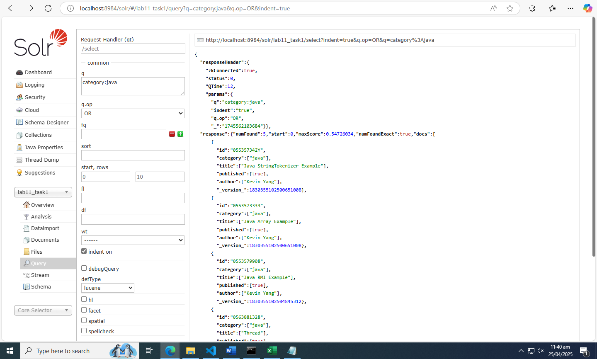
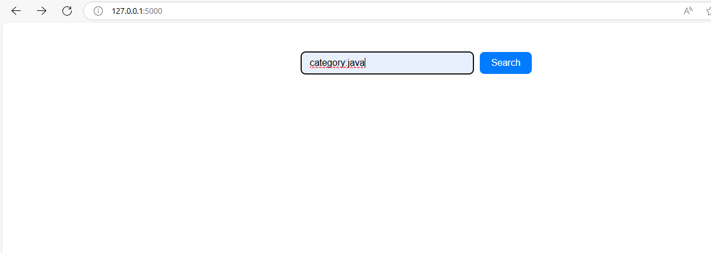
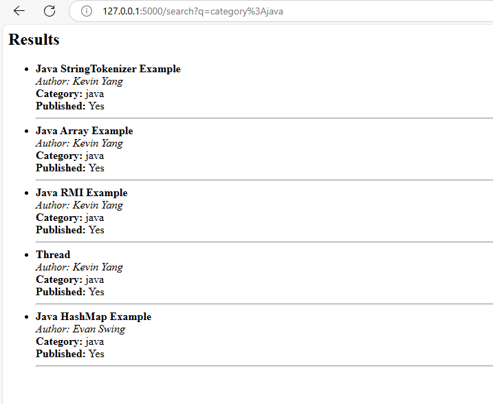
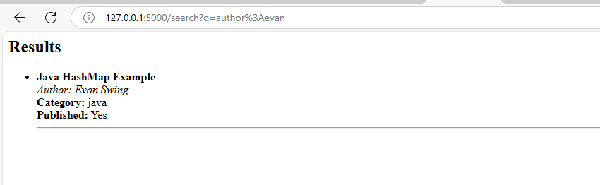

# Solr and Flask Pdc Lab 11: Indexing, Importing, and Searching Data in Apache Solr

## Introduction
Apache Solr is a high-performance, scalable, full-text search engine. It is widely used in applications requiring complex searching and indexing of large volumes of data, such as e-commerce websites, enterprise applications, and big data platforms.

## Indexing Data
Indexing enables users to quickly locate information in documents by collecting, parsing, and storing them for efficient search performance.

## Importing Data
Solr supports importing data from various sources like XML, CSV, database tables, and file formats like Word and PDF. Common ways to import data:
- Using **Solr Cell** (Apache Tika).
- Uploading XML via HTTP requests.
- Writing custom Java applications with Solr’s Client API.

## Searching
Solr processes search queries via **request handlers**, offering features like:
- Full-text search
- Hit highlighting
- Faceted search
- Geospatial search
- Dynamic clustering

Solr is highly scalable, fault-tolerant, and powers search features for major internet sites.

---

## Objectives
- Install, set up, and understand the basics of Apache Solr.
- Perform indexing, importing, and searching.
- Integrate Solr with a simple web interface.

## Tools/Software
- **Apache Solr**

Useful Links:
- [Solr Guide](https://solr.apache.org/guide/)
- [Distributed Indexing and Searching](https://blog.kiprosh.com/distributed-indexing-and-searching-with-apache-solrcloud)
- [SolrCloud Sharding Guide](https://solr.apache.org/guide/6_6/distributed-search-with-index-sharding.html)

---

## Tasks

### Task 1: Index, Import, and Search Data
- Created a cluster of servers (shards).
- Indexed and imported sample data.
- Performed searches using Solr interface.

### Task 2: Integrate Solr with Web Interface
- Built a simple search UI using Flask.
- Connected the frontend to the Solr backend via REST API.
- Displayed real-time search results with autocomplete and filters.

Github Link: [Solr and Web Interface Searching](https://github.com/786RY9/Solr-and-Web-Interface-Searching-)

---

## Output Screenshots

### 1. Solr Admin Panel

---

### 2. Search Results Interface

---

### 3. Search Result Autocomplete

---

### 4. Filtered Search Results

---
